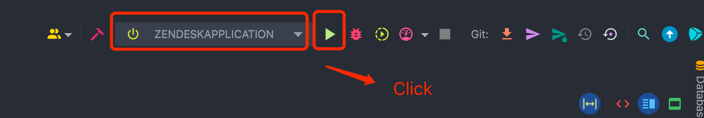
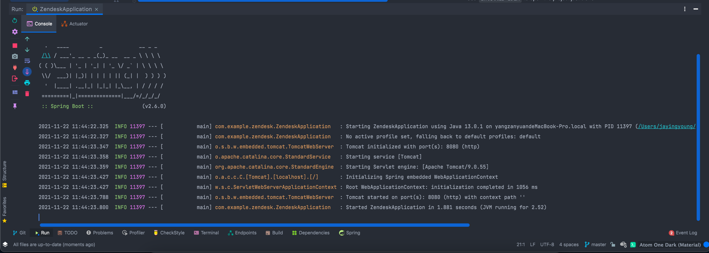

# Zendesk Intern Coding Challenge

## Installation
- Open terminal, and type `git clone https://github.com/ZanyuanYang/Zendesk-Coding-Challenge.git` to download the code
- Use `IntelliJ IDEA` to open the project just clone
- Click `Run` button to run the project 
- After seeing below message in console, this means the project is running successfully 
- Open the Browser(`Chrome/Safari/Firefox/etc`)
- Type `http://localhost:8080/tickets` to view all tickets
- Click the subject link or type `http://localhost:8080/singleTickets?ticketId=1` to view the single tickets(If the `tickets(tickerId)` doesn't exist, it will show the error message).

## Technique
- SpringBoot
- FreeMarker